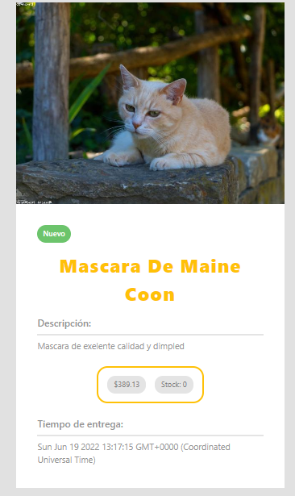

# C8-41-t-mern

<div align="center">
  
</div>

<h3 align="center">
    Ecommerce del equipo C8-41 usando el stack MERN 💻🚀
</h3>

<p align="center">
  <a href="#about-the-project">About The Project</a> |
  <a href="#layout">Layout</a> |
  <a href="#technologies">Technologies</a> |
  <a href="#contribution">Contribution</a> |
  <a href="#authors">Author</a> |
  <a href="#license">License</a>
</p>

</br>

---

<h4 align="center">
	🚧 Status: Building 🚀  🚧

  <p align="center"> c8-41-t-mern.vercel.app </p>

</h4>

---

</br>

<h2 id="about-the-project" > ⏰📈 About The Project </h2>

1.
2.
3.
4.

## Next features:

- [ ] ;
- [ ] ;
- [ ] ;

---

## 🚀 Getting Started

### FRONTEND

First, run the development server:

```bash
# Clone Repository
$ git clone https://github.com/No-Country/C8-41-t-mern.git
# Go to a specific folder
$ cd client
# Install Dependencies
$ npm i
# Run Aplication with ViteJS
$ npm run dev
```

### BACKEND

First, run the development server:

```bash
# Clone Repository
$ git clone https://github.com/No-Country/C8-41-t-mern.git
# Install Dependencies
$ npm i
# Create .env for Environment Variables.
$ cp .env.example .env
# Configure the .env with your Connection Data.
  DB_NAME=
  PORT=
  SECRETORPRIVATEKEY=
  ACCESS_TOKEN=
# Run Aplication
$ npm start
```

---

<h2 id="layout" >🎨  Layout </h2>

The ecommerce preview:

**NOTE:** In each image, there will be a short review of how the process was to build the result seen.

---

### Footer


---

### Single Card


---

### Product Detail



---

### Footer


---

### Footer


---

### Footer


---

### Footer


---

---

<h2 id="technologies"> 🛠 Technologies </h2>

The following tools were used in the construction of the project:

- **[ReactJS](https://reactjs.org)**
- **[Javascript](https://www.javascript.com/)**
- **[Redux](https://redux.js.org/)**
- **[Axios](https://github.com/axios/axios)**
- **[ViteJS](https://vitejs.dev/)**
- **[NodeJS](https://nodejs.org/en/)**
- **[ExpressJS](https://expressjs.com/)**
- **[MongoBD](https://www.mongodb.com/)**
- **[Bootstrap](https://getbootstrap.com/)**

---

<h2 id="contribution"> 💪 Contribution </h2>

Contributions are what make the open source community such an amazing place to be learn, inspire, and create. Any contributions you make are **greatly appreciated**.

1. Fork the Project
2. Create your Feature Branch (`git checkout -b feature/AmazingFeature`)
3. Commit your Changes (`git commit -m 'Add some AmazingFeature'`)
4. Push to the Branch (`git push origin feature/AmazingFeature`)
5. Open a Pull Request

---

<h2 id="authors"> 💻 Authors </h2>

|                                                                                                                                                                                                                             |
| :-------------------------------------------------------------------------------------------------------------------------------------------------------------------------------------------------------------------------------------------------------------------------------------------------------------------------------: | --- |
|                                                                                                                                                         Fausto Centurion                                                                                                                                                          |
| <a href="#"></a> <a href="https://www.linkedin.com/in/jose-andres-gavilanes-2954691b5/"></a> |     |

|                                                                                                                                                                                                                                                                   |
| :----------------------------------------------------------------------------------------------------------------------------------------------------------------------------------------------------------------------------------------------------------------------------------------------------------------------------------------: | --- |
|                                                                                                                                                              Hristo S. Oviedo                                                                                                                                                              |
| <a href="https://github.com/hristoviedo"></a> <a href="https://www.linkedin.com/in/hristoviedo/"></a> |     |

|                                                                                                                                                                                                                                                                                                                   |
| :--------------------------------------------------------------------------------------------------------------------------------------------------------------------------------------------------------------------------------------------------------------------------------------------------------------------------------------------------------------------: | --- |
|                                                                                                                                                                         José Andrés Gavilanes                                                                                                                                                                          |
| <a href="https://github.com/joseandresgavilanes"></a> <a href="https://www.linkedin.com/in/jose-andres-gavilanes-2954691b5/"></a> |     |

|                                                                                                                                                                                                                                                                                 |
| :------------------------------------------------------------------------------------------------------------------------------------------------------------------------------------------------------------------------------------------------------------------------------------------------------------------------------------------------------: | --- |
|                                                                                                                                                                     Miguel Guerrero                                                                                                                                                                      |
| <a href="https://github.com/Eiine"></a> <a href="https://www.linkedin.com/in/jose-andres-gavilanes-2954691b5/"></a> |     |

|                                                                                                                                                                                                                                                                                    |
| :---------------------------------------------------------------------------------------------------------------------------------------------------------------------------------------------------------------------------------------------------------------------------------------------------------------------------------------------------------: | --- |
|                                                                                                                                                                         Rafael León                                                                                                                                                                         |
| <a href="https://github.com/rafa2701"></a> <a href="https://www.linkedin.com/in/jose-andres-gavilanes-2954691b5/"></a> |     |

|                                                                                                                                                                                                                                                                                         |
| :--------------------------------------------------------------------------------------------------------------------------------------------------------------------------------------------------------------------------------------------------------------------------------------------------------------------------------------------------------------: | --- |
|                                                                                                                                                                          Sergio Calbiño                                                                                                                                                                          |
| <a href="https://github.com/SergioCalbino"></a> <a href="https://www.linkedin.com/in/jose-andres-gavilanes-2954691b5/"></a> |     |

|                                                                                                                                                                                                                                                                                       |
| :------------------------------------------------------------------------------------------------------------------------------------------------------------------------------------------------------------------------------------------------------------------------------------------------------------------------------------------------------------: | --- |
|                                                                                                                                                                          Yohan Bello                                                                                                                                                                           |
| <a href="https://github.com/yohanolmedo"></a> <a href="https://www.linkedin.com/in/jose-andres-gavilanes-2954691b5/"></a> |     |

---

<h2 id="license"> 📝 License </h2>
This project is under the [MIT](./LICENSE) license.
